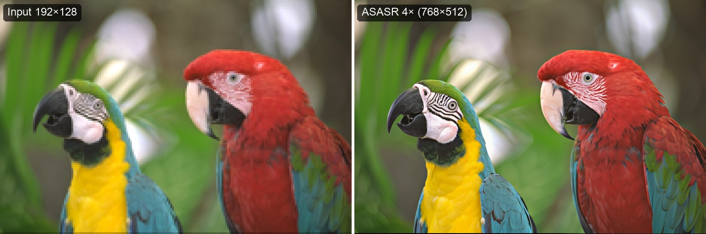
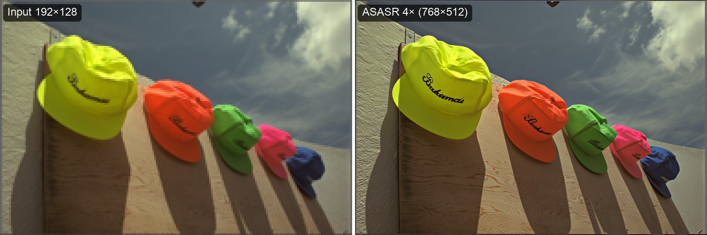
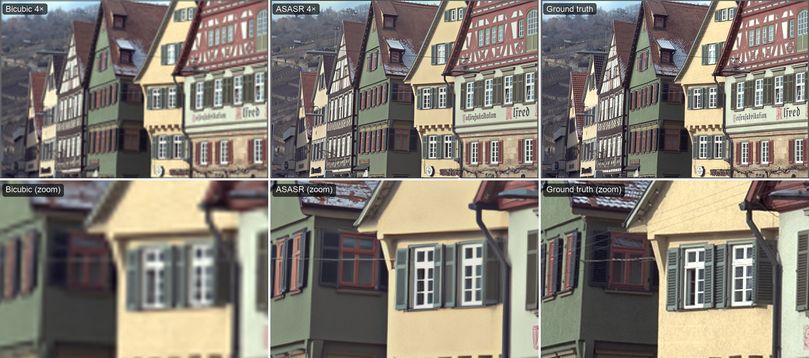
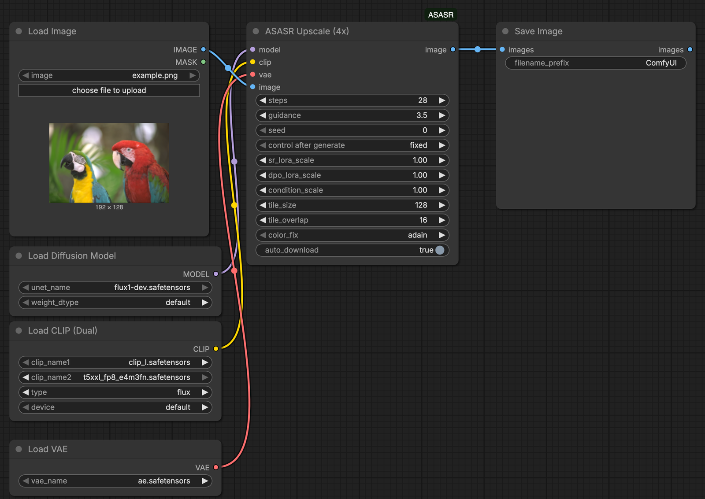

# ComfyUI-ASASR

ComfyUI node for **ASASR**, a diffusion-based 4x image super-resolution model built on a
FLUX.1-dev backbone with a dual-LoRA design (SR + DPO adapters) and
OminiControl-style image conditioning.

- Upstream project: [wafer-bob/ASASR](https://github.com/wafer-bob/ASASR)
- Model weights: [wafer-bob/ASASR on Hugging Face](https://huggingface.co/wafer-bob/ASASR)

All credit for the ASASR model, training, and inference code goes to its
original authors (wafer-bob / Kuaishou Technology). This repository is a
ComfyUI integration of their published model and weights.



> **Non-commercial use only.** The ASASR model weights and the code derived
> from the upstream repository (`asasr/vendor/`, `asasr/color_fix.py`) are
> licensed under **CC-BY-NC-4.0**. They may not be used commercially. See
> [License](#license) below.

## What it does

One node, **ASASR Upscale (4x)**, takes a FLUX.1-dev `MODEL`, `CLIP` and
`VAE` from ComfyUI's standard loaders plus an `IMAGE`, and returns a 4x
upscaled `IMAGE` (batch-aware). Because it runs on ComfyUI's own model
types, it:

- works with **bf16, fp8 and GGUF-quantized** FLUX.1-dev checkpoints, so you
  can pick the precision your GPU can hold;
- reuses the FLUX.1-dev files you already have instead of downloading a
  separate copy;
- is loaded and offloaded by **ComfyUI's own model management**, like any
  other model in your workflow.

The input image is split into overlapping low-resolution tiles, each tile is
bicubic-upscaled to a 512px condition image, denoised with FLUX + the ASASR
LoRAs, and the resulting high-resolution tiles are feather-blended back
together. A global color-fix pass (AdaIN or wavelet) corrects for drift
against a bicubic reference of the whole image.

This is a research-grade port of an academic model. Expect it to be slow —
each 128px tile takes a full 28-step diffusion pass.

## Results

All examples below were produced end to end through the ComfyUI API with
the default settings (28 steps, guidance 3.5, `tile_size` 128,
`tile_overlap` 16, `color_fix` adain). Inputs are images from the Kodak
Lossless True Color Image Suite, downscaled 4× with bicubic filtering, so
the original image serves as ground truth.

**Before / after** (left: 192×128 input, shown with nearest-neighbor
scaling; right: ASASR 4× output):



**Compared with bicubic upscaling and the original image**, with zoomed
crops in the bottom row:



ASASR is a generative model: it reconstructs plausible fine detail such as
window frames, lettering and textures instead of interpolating blur. Small
details that are lost entirely in the input, like thin wires or exact
letter shapes, are reinvented rather than recovered, so the output is not
a faithful reconstruction of the original.

The bf16, fp8 and GGUF Q8 variants produce visually equivalent results;
see [Performance](#performance).

## Requirements

- ComfyUI, running on Python >= 3.10.
- An NVIDIA GPU with CUDA. Peak VRAM is about 35 GB with a bf16 checkpoint
  and about 25 GB with fp8 or GGUF Q8 (see [Performance](#performance)).
  Other ComfyUI backends (Apple Silicon/MPS, CPU) have not been tested.
- FLUX.1-dev model files (see [Models](#models)).
- The two ASASR LoRA adapters (~885 MB SR LoRA + ~111 MB DPO LoRA), which
  auto-download on first run (see [LoRA weights](#lora-weights)).

## Installation

### Option A: ComfyUI Manager / Comfy Registry

Once published, search for "ASASR" in ComfyUI Manager, or install it with
[comfy-cli](https://docs.comfy.org/comfy-cli/getting-started):

```bash
comfy node install comfyui-asasr
```

(Not yet published — use the manual method below in the meantime.)

### Option B: Manual

```bash
cd ComfyUI/custom_nodes
git clone https://github.com/claussteinmassl/ComfyUI-ASASR.git
cd ComfyUI-ASASR
pip install -r requirements.txt
```

Run `pip install` using the same Python environment ComfyUI itself uses
(e.g. activate ComfyUI's venv first, or use its embedded Python).

Restart ComfyUI afterward.

## Models

ASASR runs on FLUX.1-dev, loaded through ComfyUI's standard loader nodes.

**FLUX.1-dev** is a **gated** model on Hugging Face. Accept the license at
[huggingface.co/black-forest-labs/FLUX.1-dev](https://huggingface.co/black-forest-labs/FLUX.1-dev)
(requires a free Hugging Face account), then download from that repository
with your own Hugging Face access token:

| File | Put it in | Load it with |
| --- | --- | --- |
| `flux1-dev.safetensors` | `models/diffusion_models/` (or `models/unet/`) | **UNETLoader** (Load Diffusion Model) |
| `ae.safetensors` | `models/vae/` | **VAELoader** |

**Text encoders:** `clip_l.safetensors` and a T5-XXL file (e.g.
`t5xxl_fp16.safetensors` or `t5xxl_fp8_e4m3fn.safetensors`) from
[comfyanonymous/flux_text_encoders](https://huggingface.co/comfyanonymous/flux_text_encoders),
placed in `models/text_encoders/` and loaded with **DualCLIPLoader**
(type `flux`).

**Lower VRAM:** set UNETLoader's `weight_dtype` to `fp8_e4m3fn` to load
the bf16 checkpoint in fp8, or use a GGUF-quantized FLUX.1-dev checkpoint
with [ComfyUI-GGUF](https://github.com/city96/ComfyUI-GGUF)'s
`UnetLoaderGGUF` (install that node pack separately). Any loader that
produces a FLUX.1-dev `MODEL` works. Quantized conversions of FLUX.1-dev
remain subject to the FLUX.1-dev license.

### LoRA weights

The SR and DPO LoRA adapters are downloaded automatically on first use
(via `huggingface_hub`), into:

```
<ComfyUI>/models/loras/ASASR/
  sr_lora/pytorch_lora_weights_v2.safetensors
  dpo_lora/adapter_model.safetensors
```

To place them manually instead (e.g. on an offline machine), download the
same two files from
[huggingface.co/wafer-bob/ASASR](https://huggingface.co/wafer-bob/ASASR) and
put them at those exact relative paths under
`<ComfyUI>/models/loras/ASASR/`. Set `auto_download` to `false` on the
node once the files are in place if you want to skip the network check
entirely.

## ASASR Upscale (4x)

Takes an image batch and returns a 4x upscaled batch (`IMAGE` → `IMAGE`).

| Input | Type | Default | Notes |
| --- | --- | --- | --- |
| `model` | MODEL | — | FLUX.1-dev UNet from UNETLoader, ComfyUI-GGUF's UnetLoaderGGUF, or any other loader producing a FLUX `ModelPatcher`. |
| `clip` | CLIP | — | From DualCLIPLoader (`clip_l` + `t5xxl`, type `flux`). Used only to encode the empty text prompt — ASASR conditions on the LR image, not on text. |
| `vae` | VAE | — | From VAELoader, the FLUX `ae.safetensors`. |
| `image` | IMAGE | — | Batch of images to upscale. |
| `steps` | INT | `28` (range 1–100) | Diffusion steps per tile. |
| `guidance` | FLOAT | `3.5` (range 0.0–20.0, step 0.1) | Classifier-free guidance scale. |
| `seed` | INT | `0` | Base seed; each tile uses a deterministic offset seed, so results are reproducible per batch and per tile layout. |
| `sr_lora_scale` | FLOAT | `1.0` (range 0.0–2.0, step 0.05) | Scale of the internally-applied SR LoRA delta. See [ASASR LoRAs are applied internally](#asasr-loras-are-applied-internally-not-via-a-lora-loader) below. |
| `dpo_lora_scale` | FLOAT | `1.0` (range 0.0–2.0, step 0.05) | Scale of the internally-applied DPO LoRA delta. Same note applies. |
| `condition_scale` | FLOAT | `1.0` (range 0.0–4.0, step 0.05) | OminiControl condition attention scale. Values other than `1.0` allocate a dense attention bias, which is memory-expensive at production resolution; `1.0` is the fast path. |
| `tile_size` | INT | `128` (range 64–512, step 16) | LR-side tile edge length, in pixels. See [Tiling](#tiling). |
| `tile_overlap` | INT | `16` (range 0–63) | LR-side overlap between adjacent tiles. Internally clamped to at most half of `tile_size`. |
| `color_fix` | combo | `adain` | `adain`, `wavelet`, or `none`. Applied globally after tiles are merged. |
| `auto_download` | BOOLEAN | `true` | Auto-download the ASASR LoRA weights (see [LoRA weights](#lora-weights)) if missing. |

### ASASR LoRAs are applied internally, not via a LoRA loader

The SR and DPO LoRA adapters are downloaded automatically and
applied **internally**, inside the node, as branch-gated deltas restricted
to the OminiControl condition branch.

> **Do not load the ASASR LoRA files with a normal LoRA loader
> (e.g. `LoraLoaderModelOnly`) and feed the patched model into this node.**
> A regular LoRA loader has no notion of which branch a delta belongs to
> and would apply it to the main FLUX branch as well, which deviates from
> the regime ASASR was trained under and will produce incorrect results.
> Let `sr_lora_scale` / `dpo_lora_scale` on this node control the adapter
> strength instead.

### Memory management

Model loading and offloading is entirely ComfyUI's own
(`load_models_gpu`) — the model behaves like any other model in a ComfyUI
workflow and is subject to ComfyUI's normal VRAM management and "Free
model and node cache" behavior. In addition to the loaded FLUX model, the
node keeps one LoRA delta store resident on the compute device, roughly
~2.1 GB in fp32.

### Known deviations from upstream

- **T5 empty-prompt padding**: ASASR conditions on an empty text prompt.
  Comfy's T5 tokenizer convention pads/truncates to 256 tokens, while the
  upstream reference implementation uses 512. The expected impact is
  negligible, since the prompt is empty either way and image conditioning
  dominates.
- **`condition_scale != 1.0`** allocates a dense attention bias tensor,
  which is memory-expensive at production (non-tile) resolutions. Leave it
  at `1.0` unless you specifically need to tune this and can afford the
  memory cost.
- **No ComfyUI attention patches / ControlNet**: the forward pass
  calls comfy's Flux block modules directly rather than going through
  comfy's `transformer_options` hook, so attention patches,
  `transformer_options`, and ControlNet do not apply to this node.

### Numerical parity

The node's forward pass is verified against the upstream `diffusers`
reference implementation (vendored in `asasr/vendor/`, used only by the
test suite) with tiny twin models (matching architecture, randomly
initialized to keep the test fast) covering the base FLUX forward, the
LoRA-patched forward, the OminiControl condition branch, and the
`condition_scale` attention bias. Maximum observed deviation is
approximately `4e-7`, well under the `1e-4` parity gate used by the test
suite.

## Performance

Measured on an NVIDIA RTX PRO 6000 Blackwell (96 GB) with ComfyUI
`b5cc883`, PyTorch 2.14 / CUDA 13.0, default settings (28 steps,
`tile_size` 128). Every variant ran in a fresh ComfyUI process; VRAM is
the device-wide peak reported by `nvidia-smi`, including the text encoders
and VAE.

| Checkpoint | Time per tile | 768×512 output (2 tiles) | 1536×1024 output (12 tiles) | Peak VRAM |
| --- | --- | --- | --- | --- |
| FLUX.1-dev bf16 | 5.5 s | 11.3 s | 65.4 s | 35.3 GB |
| FLUX.1-dev fp8 (e4m3fn) | 7.0 s | 14.3 s | 83.6 s | 24.6 GB |
| FLUX.1-dev GGUF Q8_0 | 8.5 s | 17.4 s | 101.9 s | 25.1 GB |

Times are for a warm model; the first run after starting ComfyUI adds
roughly 10–20 s of model loading. Runtime scales linearly with the number
of tiles.

- **Quality:** all three variants produce visually equivalent output. The
  bf16 variant matches the upstream `diffusers` reference implementation
  up to bf16 rounding.
- **fp8 saves memory, not time:** on this GPU the fp8 weights are cast
  per layer during the forward pass, so fp8 is slower than bf16.
- **Smaller GPUs:** with ComfyUI limited to a 24 GB budget
  (`--reserve-vram 72` on the 96 GB card) the fp8 and GGUF variants ran
  at unchanged speed, and fp8 also stayed within a 16 GB budget. These
  were simulated limits on a large card, not tests on real 16/24 GB GPUs.

## Tiling

ASASR was trained on 128px → 512px tiles, so `tile_size = 128` (the
default) is the model's native, most faithful operating point.

The input image is padded and split into a grid of overlapping tiles of
`tile_size` x `tile_size` pixels (LR side). Each tile is bicubic-upscaled to
512x512 to form the FLUX conditioning image, denoised for `steps` steps, and
the resulting 4x tile is blended into the output using a feathered mask over
the overlap region (`tile_overlap`) so seams don't show. After all tiles are
merged, a global color-fix pass (AdaIN or wavelet, from the StableSR
color-fix method) aligns the result's color statistics with a bicubic
upscale of the original input.

When to change the defaults:

- **Larger `tile_size`** processes fewer tiles per image (faster overall),
  but moves away from the model's trained regime and can lose fine detail
  fidelity. Generation always runs at the model's native 512px condition
  resolution: for `tile_size` above 128, the per-tile result is
  bicubic-resized from that 512px render, so tile sizes above 128 do not add
  model-generated detail beyond a 512px-per-tile render. `tile_size = 128`
  is the faithful, native setting.
- **Larger `tile_overlap`** reduces visible seams at the cost of more
  redundant diffusion work (more overlapping pixels are computed twice).
  It cannot exceed half of `tile_size`.
- **`color_fix: none`** skips the global color correction if you plan to do
  your own color grading downstream, or if you notice color-fix artifacts
  on unusual inputs.

A 512x512 input at the default `tile_size=128` already produces 16+ tiles
(before overlap padding), each requiring a full diffusion pass — this is
the main cost driver, not image resolution alone.

## Example workflow

A minimal graph (LoadImage + UNETLoader + DualCLIPLoader + VAELoader →
ASASR Upscale (4x) → SaveImage) is included at
[`example_workflows/asasr_upscale_example.json`](example_workflows/asasr_upscale_example.json):



Load it in ComfyUI via **Workflow → Open** (or drag the file onto the
canvas). Once the node pack is installed, it also appears in ComfyUI's
template browser under ComfyUI-ASASR. Swap the `UNETLoader` node for
ComfyUI-GGUF's `UnetLoaderGGUF` to use a GGUF-quantized checkpoint.

## License

- **ComfyUI integration code in this repository** (everything outside
  `asasr/vendor/` and `asasr/color_fix.py`): **MIT**. See [LICENSE](LICENSE).
- **`asasr/vendor/` and `asasr/color_fix.py`**, derived from the upstream
  [ASASR](https://github.com/wafer-bob/ASASR) repository, and **the ASASR
  model weights** (downloaded separately from Hugging Face): **CC-BY-NC-4.0
  — non-commercial use only**. See [`asasr/vendor/LICENSE`](asasr/vendor/LICENSE).
  The model weights additionally inherit the non-commercial terms of the
  underlying FLUX.1-dev model.

Because the model weights and part of the code are non-commercial, **the
combined package (this repository plus the downloaded weights) is for
non-commercial use only**, regardless of the MIT license on the node code
itself.

## Credits

- **ASASR** model, LoRA weights, and inference code: the ASASR authors
  (wafer-bob) and Kuaishou Technology —
  [github.com/wafer-bob/ASASR](https://github.com/wafer-bob/ASASR),
  [huggingface.co/wafer-bob/ASASR](https://huggingface.co/wafer-bob/ASASR).
- **Color-fix routines** (AdaIN / wavelet reconstruction): adapted from
  StableSR's color-fix implementation by Li Yi —
  [pkuliyi2015/sd-webui-stablesr](https://github.com/pkuliyi2015/sd-webui-stablesr/blob/master/srmodule/colorfix.py).
- **Example images**: Kodak Lossless True Color Image Suite
  (`kodim03`, `kodim08`, `kodim23`), released by Eastman Kodak for
  unrestricted use.
- **FLUX.1-dev**: Black Forest Labs —
  [huggingface.co/black-forest-labs/FLUX.1-dev](https://huggingface.co/black-forest-labs/FLUX.1-dev).
